<div align="center" padding=25px>
    
</div>

# <div align="center">Streaming ETL and Event Stream Processing using ksqlDB</div>
## <div align="center">Lab Guide</div>
<br>

## **Agenda**
1. [Log into Confluent Cloud](#step-1)
2. [Create a Stream and a Table](#step-2)
3. [Create a Persistent Query](#step-3)
4. [Aggregate data](#step-4)
5. [Windowing Operations and Fraud Detection](#step-5)
6. [Pull Queries](#step-6)
7. [Confluent Resources and Further Testing](#step-7)

***

## **Objective**

<br>

Welcome to “Streaming ETL and Event Stream Processing using ksqlDB”! In this workshop, you will learn how to build stream processing applications using ksqlDB as well as learn about the use cases ksqlDB unlocks: streaming ETL, data discovery and enrichment, anomaly detection, and more.

By the conclusion of the workshop, you will have learned how to leverage ksqlDB to perform continuous transformations, create materialized views, and serve lookups against these materialized views all with the data you already have in Confluent Cloud.

***


## <a name="step-1"></a>Log into Confluent Cloud

1. Log into [Confluent Cloud](https://confluent.cloud) and enter your email and password.

<div align="center" padding=25px>
    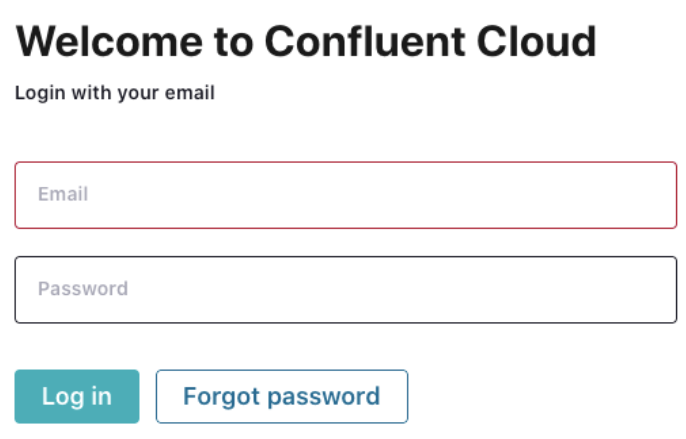
</div>

2. If you are logging in for the first time, you will see a self-guided wizard that walks you through spinning up a cluster. Please minimize this as you will walk through those steps in this workshop. 

***


## <a name="step-2"></a>Create a Stream and a Table

Now that you are producing a continuous stream of data to **users_topic** and **stocks_topic**, you will use ksqlDB to understand the data better by performing continuous transformations, masking certain fields, and creating new derived topics with the enriched data.

You will start by creating a stream and table, which will be the foundation for your transformations in the upcoming steps.

A *stream* provides immutable data. It is append only for new events; existing events cannot be changed. Streams are persistent, durable, and fault tolerant. Events in a stream can be keyed.

A *table* provides mutable data. New events—rows—can be inserted, and existing rows can be updated and deleted. Like streams, tables are persistent, durable, and fault tolerant. A table behaves much like an RDBMS materialized view because it is being changed automatically as soon as any of its input streams or tables change, rather than letting you directly run insert, update, or delete operations against it.

To learn more about *streams* and *tables*, the following resources are recommended:
- [Streams and Tables in Apache Kafka: A Primer](https://www.confluent.io/blog/kafka-streams-tables-part-1-event-streaming/)
- [ksqlDB: Data Definition](https://docs.ksqldb.io/en/latest/reference/sql/data-definition/)

<br>

1. Navigate back to the **ksqlDB** tab and click on your application name. This will bring us to the ksqlDB editor. 

> **Note:** You can interact with ksqlDB through the **Editor**. You can create a stream by using the `CREATE STREAM` statement and a table using the `CREATE TABLE` statement. <br><br>To write streaming queries against **users_topic** and **stocks_topic**, you will need to register the topics with ksqlDB as a stream and/or table. 

2. First, create a **Stream** by registering the **stocks_topic** as a stream called **stocks_stream**. 

```sql
CREATE STREAM stocks_stream (
    side varchar, 
    quantity int, 
    symbol varchar, 
    price int, 
    account varchar, 
    userid varchar
) 
WITH (kafka_topic='stocks_topic', value_format='JSON');
```

3. Next, go to the **Streams** tab at the top and click on **STOCKS_STREAM**. This provides information on the stream, output topic (including replication, partitions, and key and value serialization), and schemas.

<div align="center">
    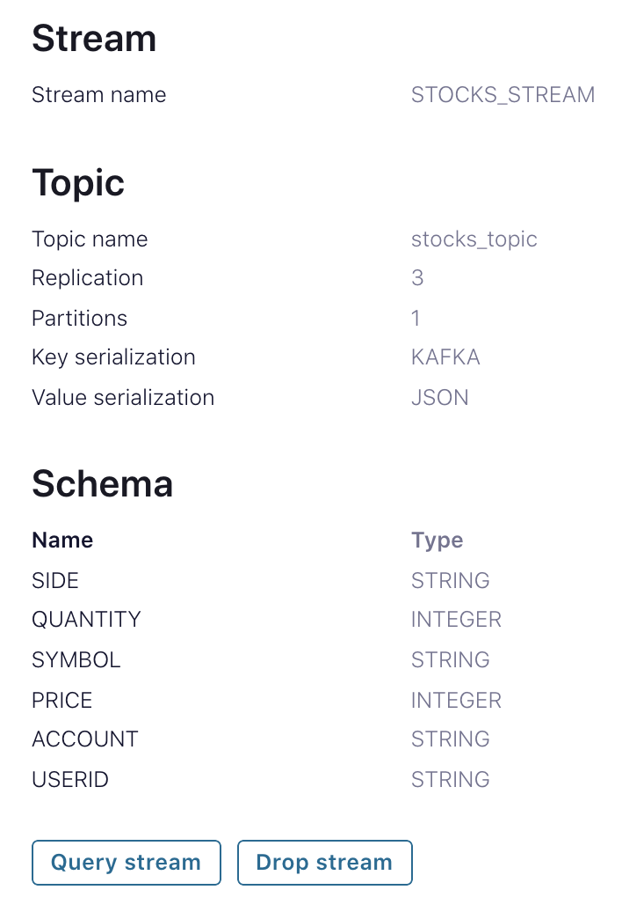
</div>

4. Click on **Query Stream** which will take you back to the **Editor**. You will see the following query auto-populated in the editor which may be already running by default. If not, click on **Run query**. To see data already in the topic, you can set the `auto.offset.reset=earliest` property before clicking **Run query**. <br> <br> Optionally, you can navigate to the editor and construct the select statement on your own, which should look like the following.

```sql
SELECT * FROM STOCKS_STREAM EMIT CHANGES;
```

5. You should see the following data within your **STOCKS_STREAM** stream.

<div align="center">
    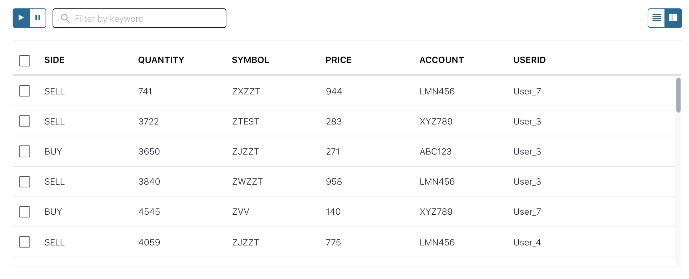
</div>

6. Click **Stop**. 
7. Next, create a **Table** by registering the **users_topic** as a table named **users**. Copy the following code into the **Editor** and click **Run**. 

```sql
CREATE TABLE users (
    userid varchar PRIMARY KEY, 
    registertime bigint, 
    gender varchar, 
    regionid varchar
) 
WITH (KAFKA_TOPIC='users_topic', VALUE_FORMAT='JSON');
```

8. Once you have created the **USERS** table, repeat what you did above with **STOCKS_STREAMS** and query the **USERS** table. This time, select the **Tables** tab and then select the **USERS** table. You can also set the `auto.offset.reset=earliest`. Like above, if you prefer to construct the statement on your own, make sure it looks like the following. 

```sql
SELECT * FROM USERS EMIT CHANGES;
```

 * You should see the following data in the messages output.

<div align="center">
    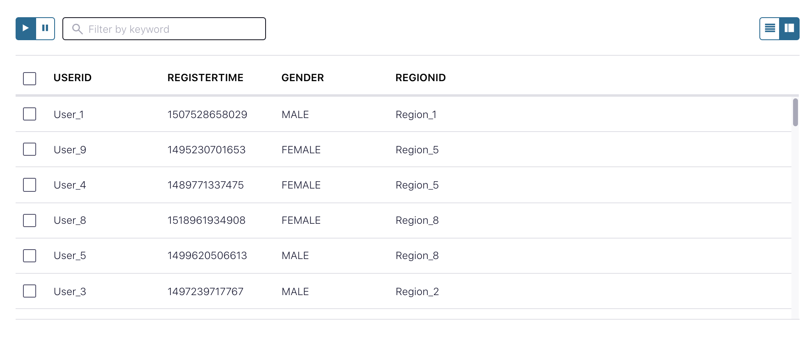
</div>

> **Note:** Note: If the output does not show up immediately, you may have done everything correctly and it just needs a moment. Setting `auto.offset.reset=earliest` also helps output data faster since the messages are already in the topics.

9. Stop the query by clicking **Stop**. 

***

## <a name="step-3"></a>Create a Persistent Query

A *Persistent Query* runs indefinitely as it processes rows of events and writes to a new topic. You can create persistent queries by deriving new streams and new tables from existing streams or tables.

1. Create a **Persistent Query** named **stocks_enriched** by left joining the stream (**STOCKS_STREAM**) and table (**USERS**). Navigate to the **Editor** and paste the following command.

```sql
CREATE STREAM stocks_enriched AS
    SELECT users.userid AS userid, 
           regionid, 
           gender, 
           side, 
           quantity, 
           symbol, 
           price, 
           account
    FROM stocks_stream
    LEFT JOIN users
    ON stocks_stream.userid = users.userid
EMIT CHANGES;
```

2. Using the **Editor**, query the new stream. You can either type in a select statement or you can navigate to the stream and select the query button, similar to how you did it in a previous step. You can also choose to set `auto.offset.reset=earliest`. Your statement should be the following. 

```sql
SELECT * FROM STOCKS_ENRICHED EMIT CHANGES;
```
* The output from the select statement should be similar to the following: <br> 

<div align="center">
    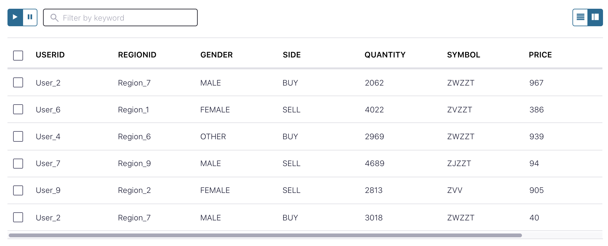
</div> 

> **Note:** Now that you have a stream of records from the left join of the **USERS** table and **STOCKS_STREAM** stream, you can view the relationship between user and trades in real-time.

4. Next, view the topic created when you created the persistent query with the left join. Navigate to the **Topics** tab on the left hand menu and then select the topic prefixed with a unique ID followed by **STOCKS_ENRICHED**. It should resemble **pksqlc-xxxxxSTOCKS_ENRICHED**. 

<div align="center">
    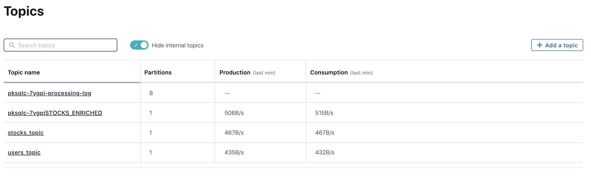
</div>

5. Navigate to **Consumers** on the left hand menu and find the group that corresponds with your **STOCKS_ENRICHED** stream. See the screenshot below as an example. This view shows how well your persistent query is keeping up with the incoming data. You can monitor the consumer lag, current and end offsets, and which topics it is consuming from.

<div align="center">
    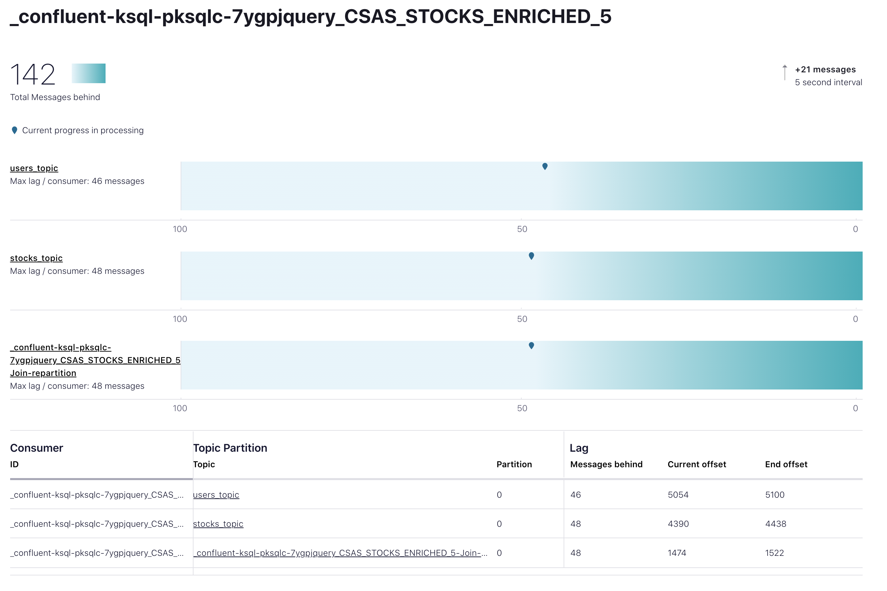
</div>

***

## <a name="step-4"></a>Aggregate Data

ksqlDB supports several aggregate functions, like `COUNT` and `SUM`, and you can use these to build stateful aggregates on streaming data. In this step, you will walk through some key examples on different ways you can aggregate your data.

1. First, aggregate the data by counting buys and sells of stocks. Navigate back to the Editor and paste the following query to create a new table named **number_of_times_stock_bought**.

```sql
CREATE TABLE number_of_times_stock_bought AS
    SELECT SYMBOL,
           COUNT(QUANTITY) AS total_times_bought
    FROM STOCKS_STREAM
    WHERE side = 'BUY'
    GROUP BY SYMBOL
EMIT CHANGES;
```
2. Next, query this table by going to the **Tables** tab and selecting the query option or typing it directly into the **Editor**. You can also choose to set `auto.offset.reset=earliest`. If you write the statement yourself, make sure it looks like the following.

```sql
SELECT * FROM NUMBER_OF_TIMES_STOCK_BOUGHT EMIT CHANGES; 
```

* The results should look something like the following.

<div align="center">
    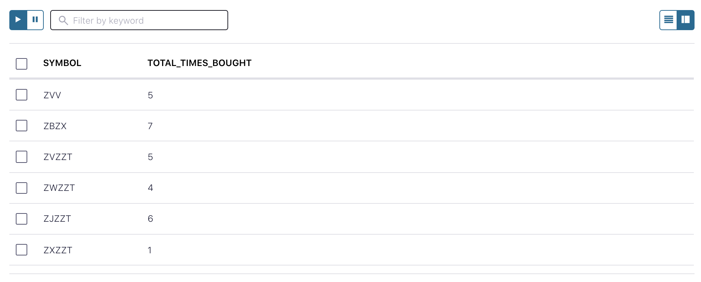
</div>

3. Next, create a table that calculates the total number of stocks purchased per symbol. You can choose to set `auto.offset.reset=earliest`.

```sql
CREATE TABLE total_stock_purchased AS
    SELECT symbol,
           SUM(QUANTITY) AS TOTAL_QUANTITY
    FROM STOCKS_ENRICHED
	WHERE SIDE = 'BUY'
    GROUP BY SYMBOL;
```
* Running this query should return something that looks similar to the following.

<div align="center">
    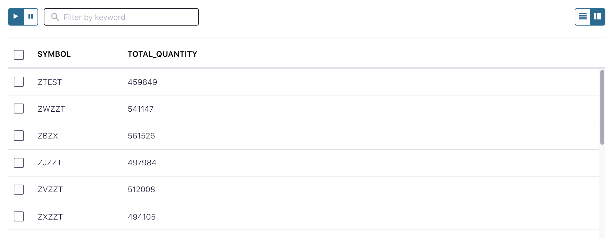
</div>

***

## <a name="step-5"></a> Windowing Operations and Fraud Detection

You will walk through a few examples on how to use ksqlDB for Windowing, including how to use it for anomaly or fraud detection. ksqlDB enables aggregation operations on streams and tables, as you saw in the previous step, and you have the ability to set time boundaries named windows. A window has a start time and an end time, which you access in your queries by using `WINDOWSTART` and `WINDOWEND`. When using Windowing, aggregate functions are applied only to the records that occur within the specified time window. ksqlDB tracks windows per record key.

There are a few different Windowing operations you can use with ksqlDB. You can learn more about them [here](https://docs.ksqldb.io/en/latest/concepts/time-and-windows-in-ksqldb-queries/#window-types).

1. In the ksqlDB **Editor**, paste the following command in order to create a windowed table named **stocks_purchased_today** from the **stocks_topic**. You can set the size of the window to any duration. Set it to 5 minutes in this example.

```sql
CREATE TABLE stocks_purchased_today AS
    SELECT symbol,
           COUNT(*) AS quantity
    FROM stocks_enriched
    WINDOW TUMBLING (SIZE 5 MINUTES)
    GROUP BY symbol;
```

2. Once you have created the windowed table, use the **Editor** or the **Tables** tab to query the table. If you construct the statement on your own, make sure it looks like the following. 

```sql
SELECT * FROM STOCKS_PURCHASED_TODAY EMIT CHANGES;
```

* The output should be similar to the following.

<div align="center">
    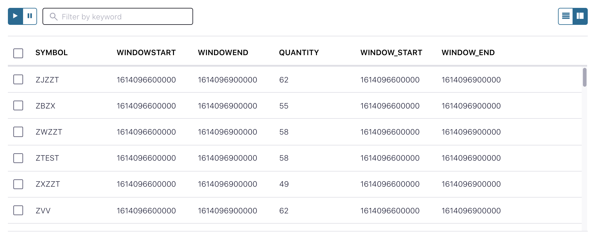
</div>

3. Going along with the theme of fraud detection, create a table named **accounts_to_monitor** with accounts to monitor based on their activity during a given time frame. In the ksqlDB **Editor**, paste the following statement and run the query.

```sql
CREATE TABLE accounts_to_monitor AS
    SELECT TIMESTAMPTOSTRING(WINDOWSTART, 'yyyy-MM-dd HH:mm:ss Z') AS WINDOW_START,
           TIMESTAMPTOSTRING(WINDOWEND, 'yyyy-MM-dd HH:mm:ss Z') AS WINDOW_END,
           ACCOUNT,
           COUNT(*) AS quantity
    FROM STOCKS_ENRICHED
    WINDOW TUMBLING (SIZE 5 MINUTES)
    GROUP BY ACCOUNT
    HAVING COUNT(*) > 10;
```

4. Once you have created the **ACCOUNTS_TO_MONITOR** table, use either the **Editor** or the **Tables** tab to query the data from the table. If you construct the statement on your own, make sure it looks like the following.

```sql
SELECT * FROM ACCOUNTS_TO_MONITOR EMIT CHANGES;
```

* The output from this query should look like the following. 

<div align="center">
    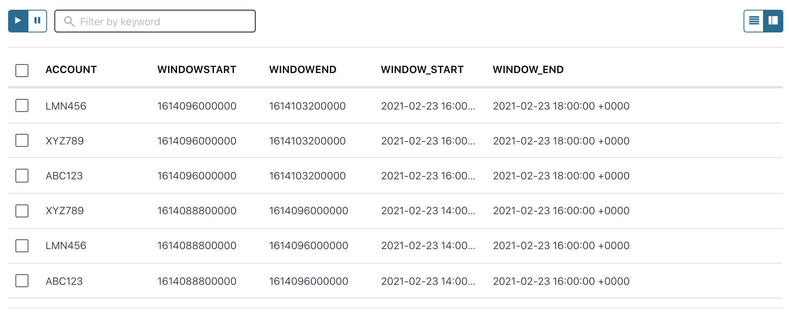
</div>

***

## <a name="step-6"></a>Pull Queries

Building on our Fraud Detection example from the last step, let’s say our fraud service wants to check on high frequency accounts. The fraud service can send a pull query via the ksql API, today we will just mock it with the UI. Then we can monitor the activity for a suspicious account. 

1. First we need to add a property to our query. Pull queries only filter by the primary key by default. To filter by other fields, we need to enable table scans. You can add a property under the auto.offset.reset one already included. You will need to set ksql.query.pull.table.scan.enabled to true

<div align="center">
    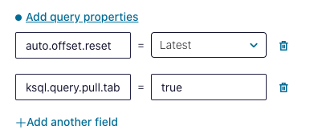
</div>

2. Now let’s run our pull query in the Editor to see how our accounts are behaving.  

```sql
SELECT * FROM ACCOUNTS_TO_MONITOR
     WHERE QUANTITY > 100;
```
3. Once we have identified a potential troublemaker, we can create an ephemeral push query to monitor future trades from our **STOCKS_ENRICHED** stream. This will continue to push trades to the fraud service for further analysis until it is stopped. 

```sql
SELECT * FROM STOCKS_ENRICHED 
	WHERE ACCOUNT = 'ABC123'
	EMIT CHANGES;
```
***

## <a name="step-7"></a>Confluent Resources and Further Testing

Here are some links to check out if you are interested in further testing:
- [ksqlDB Tutorials](https://kafka-tutorials.confluent.io/)
- [ksqlDB: The Event Streaming Database, Purpose-Build for Stream Processing](https://ksqldb.io/)
- [Streams and Tables in Apache Kafka: A Primer](https://www.confluent.io/blog/kafka-streams-tables-part-1-event-streaming/)
- [Confluent Cloud Documentation](https://docs.confluent.io/cloud/current/overview.html)
- [Best Practices for Developing Apache Kafka Applications on Confluent Cloud](https://assets.confluent.io/m/14397e757459a58d/original/20200205-WP-Best_Practices_for_Developing_Apache_Kafka_Applications_on_Confluent_Cloud.pdf)

***
